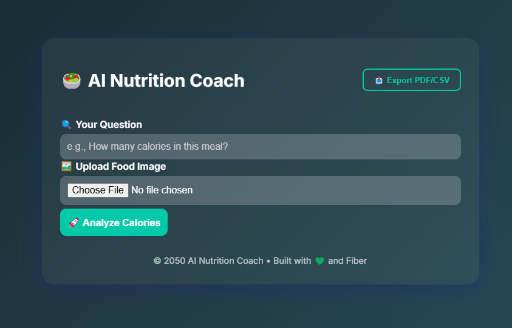
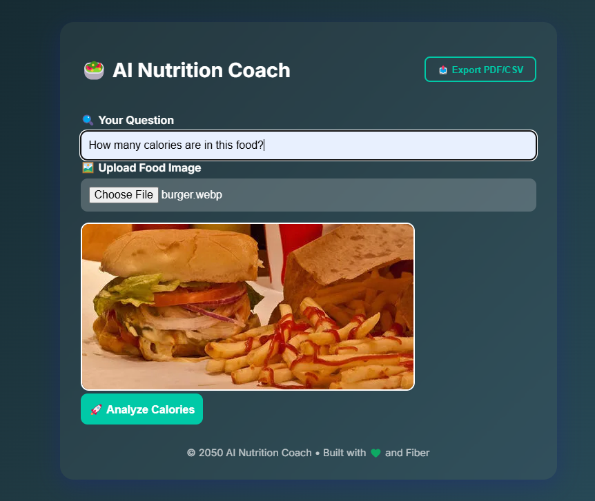
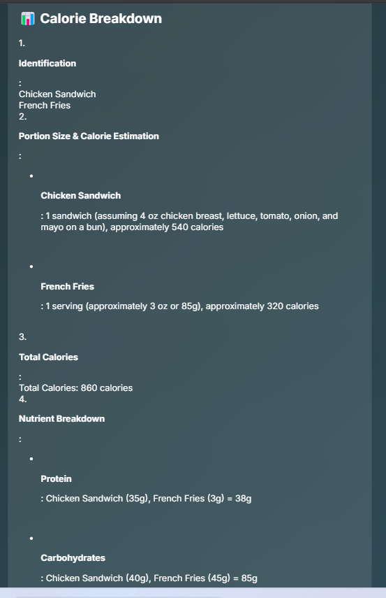
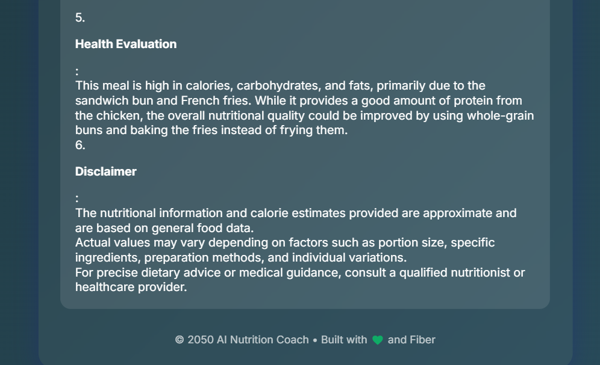

# App overview: AI Nutrition Coach

The AI Nutrition Coach app empowers users with the ability to make informed dietary choices using advanced AI technology. This app leverages the Llama 4 Maverick 17B 128E Instruct FP8 model model to analyze food images and provide valuable nutritional information. Here's a breakdown of the app's key features:

### 1. Food identification and calorie estimation

The app allows users to upload images of their meals. Once the image is uploaded, the AI model identifies the food items using its visual recognition capabilities. It then estimates the caloric content of each item based on a comprehensive nutritional database. This feature eliminates the need for manual entry and guessing, offering a quick and accurate overview of the meal's calorie count.

### 2. Nutritional breakdown

Beyond estimating total calories, the app provides a detailed nutritional breakdown of key components like fats, proteins, and carbohydrates. This feature helps users better understand the nutritional composition of their meals and how they align with their dietary goals, whether it's weight loss, muscle gain, or maintaining a balanced diet.

### 3. Personalized nutritional advice

After analyzing the meal, the app offers personalized dietary advice based on the user's health objectives and the nutritional content of the meal. For instance, it might suggest increasing fiber intake if the analyzed meal is low in it or provide recommendations to stay within specific macronutrient ranges.

---

## Application



---



---


---



---



---

---

## Project Structure

```text
media/
|-- app.py
|-- templates/
|   |-- index.html
|-- static/
    |-- style.css
|-- README.md

```

## Commands for Project Structure

```bash
touch app.py
touch README.md
mkdir templates
cd templates
touch index.html
cd ..
mkdir static
cd static
touch style.css
cd ..
```

## Commands to Run Project

### Step 1: Create your project directory

```bash
mkdir cal_coach_app
cd cal_coach_app
```

### Step 2: Set up a Python virtual environment

```bash
python3.11 -m venv my_env
source my_env/bin/activate
```

### Step 3: Install the library and packages

```bash
pip install ibm-watsonx-ai==1.1.20 image==1.5.33 flask requests==2.32.0
```
